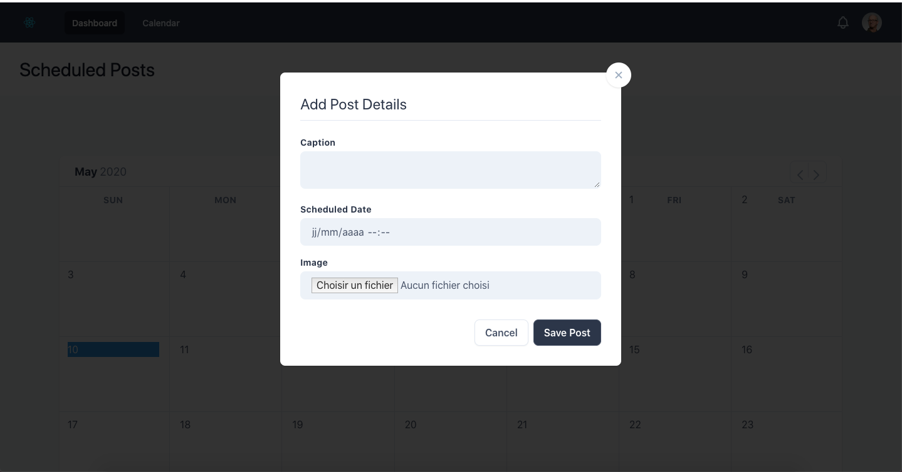

## Available Scripts

In the project directory, you can run:

### `yarn dev`

Runs the app in the development mode. 
Open [http://localhost:3000/dashboard](http://localhost:3000) to view the scrapped posts and also scrappe instagram posts

Open [http://localhost:8030/kue-api/active](http://localhost:8030/kue-api/active) to view the active job queue for scrapping instagram posts

Open [http://localhost:8030/kue-api/active](http://localhost:8030/kue-api/active) to view the active job queue for scrapping instagram posts
